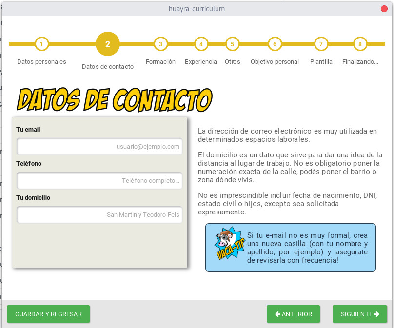

# huayra-curriculum

[](https://travis-ci.org/HuayraLinux/huayra-curriculum)

Aplicativo para generar un Curriculum Vitae de forma sencilla.



# Iniciar en modo desarrollo

## Instalar dependencias
```
npm install
npx bower install
```

## Construir y ejecutar
```
npm run build-and-dev
```

## Ejecutar
(en caso que previamente hayas construido con `npm run build` o `npm run build-and-dev`)
```
npm run dev
```

# Tecnologías utilizadas

- Ember
- Electron
